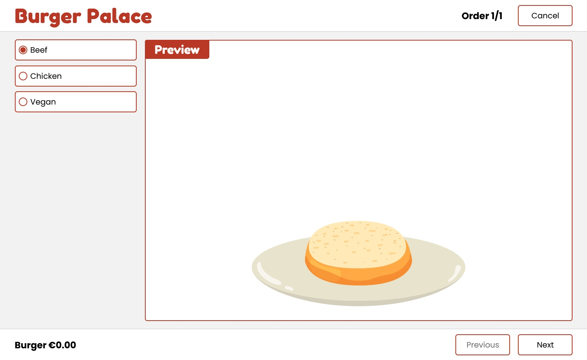

# Burger Palace

Check out the [**Live Site**](https://montee-diego.github.io/burger-palace/)!

## Screenshot

## Objective

This project can be used to make in-store or online orders for an hamburger focused shop, where you
can select everything from the type of burger to the sides and drinks. The whole design, including
fonts, colors, images and animations, was created with the idea to appeal to younger audiences.

## Technical Overview

- Built using no frameworks but thought to behave like a Single Page Application.
- Implemented Barba.js together with GSAP to create a SPA like experience.
- Used setters to automatically re-render the UI when an item is added to the order.
- Cool page transitions.
- Automatic reroute if the page is accessed from any route other than the home page.

## Compatibility

- Tested on desktop: Firefox, Chrome and Edge
- Tested on mobile: Firefox and Chrome

## Comments

The behaviour of Barba.js together with hosting on gh-pages made the page break under certain cases,
in order to fix this I implemented a small function to detect if the url contains the project
name and therefore set a "base" variable with the project name, it resembles what
frameworks use as "base" or "homepage" config.

This same base URL is used to update every image src that would also break under certain cases.
